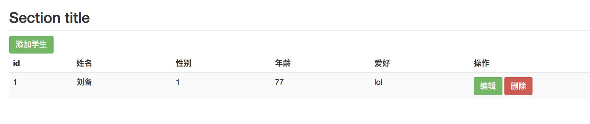
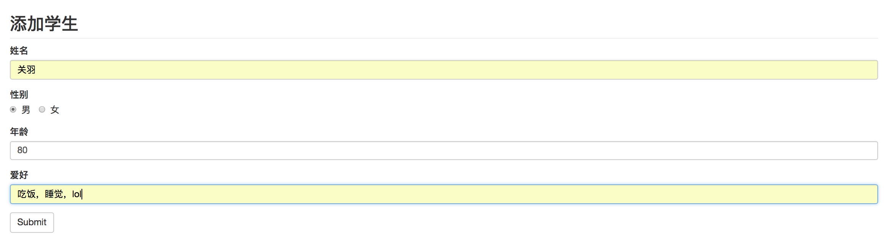
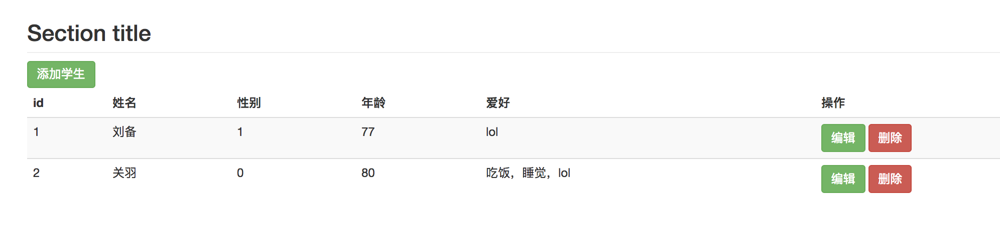
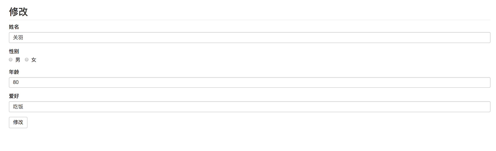

# CRUD增删改查（MongoDB数据库）

## 启动
### 1.命令行
```node app.js```
### 2.浏览器
localhost:3000/students

## 技术栈

- Node
- Express——框架
- Nodemon——免去重启node麻烦
- MongoDB——数据库
- mongoose——node操作MongoDB的第三方工具

## 实现功能

- 学生列表增删改查
- 通过路由收到请求
- 接受请求中的数据（get，post）
  - req.query
  - Req.body
- 使用MongoDB数据库的API操作数据

## 路由设计

|          |                  |          |                                |                  |
| -------- | ---------------- | -------- | ------------------------------ | ---------------- |
| 请求方法 | 请求路径         | get 参数 | post 参数                      | 备注             |
| GET      | /studens         |          |                                | 渲染首页         |
| GET      | /students/new    |          |                                | 渲染添加学生页面 |
| POST     | /studens/new     |          | name、age、gender、hobbies     | 处理添加学生请求 |
| GET      | /students/edit   | id       |                                | 渲染编辑页面     |
| POST     | /studens/edit    |          | id、name、age、gender、hobbies | 处理编辑请求     |
| GET      | /students/delete | id       |                                | 处理删除请求     |

## 注意点

1. mongoDB的id自动生成，设计表结构的时候不用设计id

   index.html中

2. ID的引用：{{ $index +1 }}

3. ID传值：{{ $value._id }}

   router.js中

4. 获取的id值是字符串，带有“”，要手动去除，否则报错

   ```powershell
   var id = req.body.id.replace(/"/g,'')
   ```
## 项目截图

  - ### 首页


  - ### 添加


  - ### 添加后的首页


  - ### 修改



